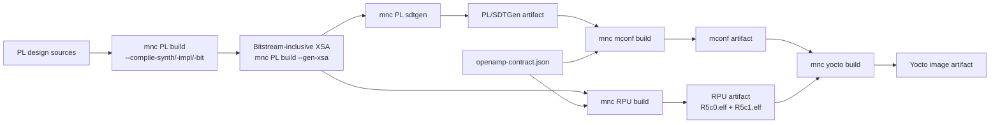

# Monutchee OS (MNCos) Project collection


## Introduction

This is a project collection of monutchee for building yocto on Xilinx devices.


## Included project

| Project      | Link                              |
| :----------  | :------------------------------   |
| zudemo       | [zudemo](zudemo/README.md)        |
| kr260demo    | [kr260demo](kr260demo/README.md)  |
| msap1        | [msap1](msap1/README.md)          |


## Initialize a product workspace

Each fresh product workspace contains three top-level directories:

- `applications/` is a repo client initialized from the product's
  `applications.xml`. It contains the APU, RPU, PL, and optional WEB
  repositories.
- `yocto-build/` is an independent repo client initialized from `yocto.xml`.
- `runtime-generated/` contains local build handoff files and is not managed
  by repo.

```bash
mkdir workspace && cd workspace
curl -fsSL "https://raw.githubusercontent.com/Monutchee/monutchee-manifest/main/<product>/setupWorkspace" | sh
```

Use `zudemo`, `kr260demo`, or `msap1` for `<product>`. The same command is
both installer and updater: in an empty directory it performs the complete
product setup; in an initialized workspace it refreshes only the generated
build scripts and workspace guidance. It does not switch or sync component
repositories during an update.

Test workflow changes from another manifest branch without changing the
installer URL:

```bash
curl -fsSL "https://raw.githubusercontent.com/Monutchee/monutchee-manifest/main/<product>/setupWorkspace" \
  | sh -s -- --branch feat/add_hex_on_artifact
```

On their first sync,
setup starts local `main` branches for the application repositories and
`yocto-build/sources/meta-monutchee`. Later setup runs preserve existing active
branches. Pinned Git submodules are initialized but remain outside the
applications manifest project set. Create or change one coordinated feature
branch across the application repositories with:

```bash
cd applications
repo start <branch> --all
repo checkout <branch>
```

Initialize a fresh directory. Setup deliberately refuses to adopt existing
standalone component clones inside `applications/` when that directory has no
`.repo`.

## Automated hardware-to-Yocto build

`setupWorkspace ... all` installs one product-aware command in the workspace
root: `mnc`, a symlink to `.monutchee-build/mnc.sh`. It is also refreshed
independently with the `scripts` component.

```bash
./mnc all build        # the product's whole chain, fresh clone to image
./mnc --tui all build  # live console with a toggleable summary pane
./mnc --list           # the targets, their scripts, and the chain order
./mnc PL build         # one stage
./mnc PL status        # a read-only query
./mnc deploy           # deploy with the workspace preset (no build log)
```

`setupWorkspace` also creates `MncBuildPreset.yaml` beside `mnc`. Set
`stages.PL.jobs` to a positive integer (for example `1`) to limit only the PL
stage in both full-chain and direct builds; `null` keeps PL's automatic
default, and an explicit `--jobs` wins. The preset uses YAML and therefore
requires PyYAML (`python3-yaml` on distributions that package it).

The same preset configures deployment. JTAG is currently the only type:

```yaml
stages:
  deploy:
    type: jtag
    xilinx_hw_server_ip: 172.30.19.20
    tftp_machine_ip: 172.30.19.19
```

`mnc deploy` runs `yocto-build/build/export/tftpboot/load-jtag-image.tcl`
through XSDB from its export directory. Use `mnc deploy jtag` to name the type
explicitly; `--xilinx-hw-server-ip` and `--tftp-machine-ip` override the
preset. Deployments intentionally do not create build reports.

Every actual `build` command streams normally and writes the same transcript
plus its final per-stage summary to
`runtime-generated/buildLog/build_YYYYMMDD_HHMMSS.log`.

`--tui` works with `all build` and individual stage builds. The console stays
in the background while the upper-right pane shows status, progress, and
elapsed/final times. Press `s` to show/hide the pane, arrows or Page Up/Down to
scroll, `End` to follow live output, and Ctrl-C to cancel. After completion,
Enter or `q` exits. A non-interactive invocation falls back to the normal
build with a warning.

TAB completion for bash and zsh: `source ./mnc` registers it in the current
shell and does nothing else (executing cannot -- a child process cannot change
its parent's shell). The first `./mnc` run from a terminal also adds one
guarded line to your shell rc, so new shells have it;
`MNC_NO_COMPLETION_INSTALL=1` declines, and nothing is written without a
terminal.

The grammar is `mnc [OPTIONS] <target> <command> [--args] [ARGUMENTS...]`.
`deploy` is the one shorthand target whose command may be omitted.
Targets are the installed stage scripts, matched case-insensitively, so `PL`
and `pl` both reach `make_PL.sh`. `build` runs the stage bare and any other
command becomes `--<command>`, which makes every stage option reachable as a
command (`mnc RPU elf-only`, `mnc PL sdtgen`). Everything after the command is
forwarded to the stage script untouched: `--args` is an optional separator
that mnc drops, and `--` is never mnc's, so `mnc yocto build -- -c cleanall`
still reaches BitBake. mnc's own options come before the target, so a stage
option can never be mistaken for one of mnc's.

`mnc all build` runs the chain declared as `MNC_CHAIN` in the product profile,
stops at the first failing stage, and prints the command that resumes from it
(`mnc --from RPU all build`). The order is per-product because it genuinely
differs: where `RPU_DEPENDS_ON_MCONF` is true, `make_RPU.sh` consumes the
mconf artifact and publishing mconf afterwards would prune the RPU artifact,
so mconf must run first.

### MSAP1 build dependencies

MSAP1 uses a dependency graph rather than a strict four-stage waterfall. The
RPU and machine configuration are produced independently from the same XSA
and OpenAMP contract, then checked for compatibility by the Yocto stage.



`xparameters.h`, generated directly from the XSA by Vitis, remains
authoritative for hardware addresses and interrupts. The shared
`openamp-contract.json` is authoritative for R5/Linux shared memory and
mailbox policy. The Yocto stage requires the mconf and RPU artifacts to carry
matching XSA and OpenAMP-contract digests.

### Recommended clean-build order

After exporting the XSA, use this sequential order in one workspace:

```bash
./mnc PL build
./mnc RPU build
./mnc mconf build
./mnc yocto build
```

`mnc PL build` should run first because publishing a new upstream PL artifact
invalidates existing mconf, RPU, and Yocto artifacts. After that stage,
`mnc RPU build` and `mnc mconf build` are independent and may run in either order
or on separate DSP/BSP build machines. Both must finish before
`mnc yocto build`.

The responsibilities of each stage are:

1. `mnc PL build` generates the block-design output products, synthesizes,
   implements, writes the bitstream, exports the bitstream-inclusive XSA to
   `runtime-generated/bin_file/<ProjectPrefix>_PL.xsa`, and publishes
   `<product>_pl_sdtgen_<sha256[:6]>.tar.gz`, whose payload contains only
   SDTGen output. Every stage is separately selectable (`--build-bd`,
   `--compile-synth`, `--compile-impl`, `--compile-bit`, `--gen-xsa`,
   `--sdtgen`) and backed by one Tcl script in the PL repository, so a single
   stage can be rerun and debugged; with no stage option all of them run in
   that order. `--status`, `--summary`, and `--report` are read-only queries
   that report on the project rather than building it, and stay usable while
   a Vivado GUI holds it open. The Vivado stages need the PL repository to
   provide those scripts, so a product whose PL repository has none keeps
   using `--sdtgen` against a hand-exported XSA. Use `--xsa FILE` to export
   to, or read from, another location.
2. `mnc mconf build` consumes the SDTGen archive and publishes
   `<product>_mconf_<sha256[:6]>.tar.gz`. It contains portable generated Yocto
   `conf` fragments and SDTGen files. For MSAP1 it also renders and packages
   the OpenAMP domain from the shared contract.
3. For MSAP1, `mnc RPU build` consumes the raw XSA and OpenAMP contract directly,
   creates the Vitis platform, and publishes
   `<product>_rpu_<sha256[:6]>.tar.gz`, containing only `R5c0.elf` and
   `R5c1.elf`. It does not require mconf, source Yocto, or run BitBake.
   After the platform has been created once, use `mnc RPU elf-only` to
   rebuild both applications without recreating the platform, provided its
   XSA and contract provenance still match.
4. `mnc yocto build` consumes the mconf and RPU archives, runs the normal
   BitBake command, and publishes selected disk/boot/JTAG outputs as
   `<product>_yocto_<sha256[:6]>.tar.gz`.

The ZU and KR260 demo profiles retain their legacy mconf-to-RPU dependency.

### Focused rebuild examples

Rebuild only changed RPU application sources while reusing the current Vitis
platform, then integrate the new firmware:

```bash
./mnc RPU build --elf-only
./mnc yocto build
```

Regenerate only machine configuration while reusing a compatible RPU
artifact:

```bash
./mnc mconf build
./mnc yocto build
```

Rebuild after changing the OpenAMP contract but not the XSA:

```bash
./mnc RPU build
./mnc mconf build
./mnc yocto build
```

Rebuild only APU, frontend, kernel, or Yocto recipe changes:

```bash
./mnc yocto build
```

If either selected mconf or RPU artifact was produced from a different XSA or
OpenAMP contract, `mnc yocto build` stops with a lineage mismatch instead of
building a mixed image.

Every archive includes a manifest and checksums, validates its product/stage,
rejects unsafe archive paths, and verifies a hash suffix when one is present.
After a canonical stage publishes successfully, its older archives and every
downstream archive are removed. A complete build therefore retains one
coherent PL, mconf, RPU, and Yocto archive set; a failed build preserves the
previous set. Input selection still accepts legacy directories containing
multiple archives by choosing the newest match and warning. Pass an explicit
input artifact option to pin a particular handoff. Use `--help` on each
command for artifact paths and BitBake argument passthrough.

For coordinated feature testing, operate on the two repo clients separately:

```bash
(cd applications && repo start feature/add-compile-command-script --all)
(cd yocto-build && repo start feature/add-compile-command-script \
  sources/meta-monutchee)
```

The build commands support `zudemo`, `kr260demo`, and `msap1` through product
profiles in `common/build/products`.

# Reference
[Xilinx yocto-manifests](https://github.com/Xilinx/yocto-manifests)
