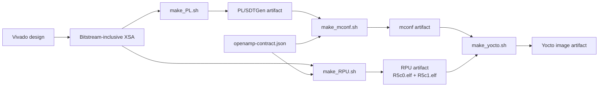

# Monutchee OS (MNCos) Project collection


## Introduction

This is a project collection of monutchee for building yocto on Xilinx devices.


## Included project

| Project      | Link                              |
| :----------  | :------------------------------   |
| zudemo       | [zudemo](zudemo/README.md)        |
| kr260demo    | [kr260demo](kr260demo/README.md)  |
| msap1        | [msap1](msap1/README.md)          |


## Initialize a product workspace

Each fresh product workspace contains three top-level directories:

- `applications/` is a repo client initialized from the product's
  `applications.xml`. It contains the APU, RPU, PL, and optional WEB
  repositories.
- `yocto-build/` is an independent repo client initialized from `yocto.xml`.
- `runtime-generated/` contains local build handoff files and is not managed
  by repo.

```bash
mkdir workspace && cd workspace
curl -fsSL "https://raw.githubusercontent.com/Monutchee/monutchee-manifest/main/<product>/setupWorkspace" | sh
```

Use `zudemo`, `kr260demo`, or `msap1` for `<product>`. The same command is
both installer and updater: in an empty directory it performs the complete
product setup; in an initialized workspace it refreshes only the generated
build scripts and workspace guidance. It does not switch or sync component
repositories during an update.

Test workflow changes from another manifest branch without changing the
installer URL:

```bash
curl -fsSL "https://raw.githubusercontent.com/Monutchee/monutchee-manifest/main/<product>/setupWorkspace" \
  | sh -s -- --branch feat/add_hex_on_artifact
```

On their first sync,
setup starts local `main` branches for the application repositories and
`yocto-build/sources/meta-monutchee`. Later setup runs preserve existing active
branches. Pinned Git submodules are initialized but remain outside the
applications manifest project set. Create or change one coordinated feature
branch across the application repositories with:

```bash
cd applications
repo start <branch> --all
repo checkout <branch>
```

Initialize a fresh directory. Setup deliberately refuses to adopt existing
standalone component clones inside `applications/` when that directory has no
`.repo`.

## Automated hardware-to-Yocto build

`setupWorkspace ... all` installs four product-aware commands in the workspace
root. The commands are also refreshed independently with the `scripts`
component.

```bash
./make_PL.sh
./make_mconf.sh
./make_RPU.sh
./make_yocto.sh
```

### MSAP1 build dependencies

MSAP1 uses a dependency graph rather than a strict four-stage waterfall. The
RPU and machine configuration are produced independently from the same XSA
and OpenAMP contract, then checked for compatibility by the Yocto stage.



`xparameters.h`, generated directly from the XSA by Vitis, remains
authoritative for hardware addresses and interrupts. The shared
`openamp-contract.json` is authoritative for R5/Linux shared memory and
mailbox policy. The Yocto stage requires the mconf and RPU artifacts to carry
matching XSA and OpenAMP-contract digests.

### Recommended clean-build order

After exporting the XSA, use this sequential order in one workspace:

```bash
./make_PL.sh
./make_RPU.sh
./make_mconf.sh
./make_yocto.sh
```

`make_PL.sh` should run first because publishing a new upstream PL artifact
invalidates existing mconf, RPU, and Yocto artifacts. After that stage,
`make_RPU.sh` and `make_mconf.sh` are independent and may run in either order
or on separate DSP/BSP build machines. Both must finish before
`make_yocto.sh`.

The responsibilities of each stage are:

1. Export the bitstream-inclusive XSA from Vivado to
   `runtime-generated/bin_file/<ProjectPrefix>_PL.xsa`. `make_PL.sh` consumes
   that existing XSA without opening Vivado, then publishes
   `<product>_pl_sdtgen_<sha256[:6]>.tar.gz`, whose payload contains only
   SDTGen output.
   Use `--xsa FILE` when the exported XSA is stored elsewhere.
2. `make_mconf.sh` consumes the SDTGen archive and publishes
   `<product>_mconf_<sha256[:6]>.tar.gz`. It contains portable generated Yocto
   `conf` fragments and SDTGen files. For MSAP1 it also renders and packages
   the OpenAMP domain from the shared contract.
3. For MSAP1, `make_RPU.sh` consumes the raw XSA and OpenAMP contract directly,
   creates the Vitis platform, and publishes
   `<product>_rpu_<sha256[:6]>.tar.gz`, containing only `R5c0.elf` and
   `R5c1.elf`. It does not require mconf, source Yocto, or run BitBake.
   After the platform has been created once, use `make_RPU.sh --elf-only` to
   rebuild both applications without recreating the platform, provided its
   XSA and contract provenance still match.
4. `make_yocto.sh` consumes the mconf and RPU archives, runs the normal
   BitBake command, and publishes selected disk/boot/JTAG outputs as
   `<product>_yocto_<sha256[:6]>.tar.gz`.

The ZU and KR260 demo profiles retain their legacy mconf-to-RPU dependency.

### Focused rebuild examples

Rebuild only changed RPU application sources while reusing the current Vitis
platform, then integrate the new firmware:

```bash
./make_RPU.sh --elf-only
./make_yocto.sh
```

Regenerate only machine configuration while reusing a compatible RPU
artifact:

```bash
./make_mconf.sh
./make_yocto.sh
```

Rebuild after changing the OpenAMP contract but not the XSA:

```bash
./make_RPU.sh
./make_mconf.sh
./make_yocto.sh
```

Rebuild only APU, frontend, kernel, or Yocto recipe changes:

```bash
./make_yocto.sh
```

If either selected mconf or RPU artifact was produced from a different XSA or
OpenAMP contract, `make_yocto.sh` stops with a lineage mismatch instead of
building a mixed image.

Every archive includes a manifest and checksums, validates its product/stage,
rejects unsafe archive paths, and verifies a hash suffix when one is present.
After a canonical stage publishes successfully, its older archives and every
downstream archive are removed. A complete build therefore retains one
coherent PL, mconf, RPU, and Yocto archive set; a failed build preserves the
previous set. Input selection still accepts legacy directories containing
multiple archives by choosing the newest match and warning. Pass an explicit
input artifact option to pin a particular handoff. Use `--help` on each
command for artifact paths and BitBake argument passthrough.

For coordinated feature testing, operate on the two repo clients separately:

```bash
(cd applications && repo start feature/add-compile-command-script --all)
(cd yocto-build && repo start feature/add-compile-command-script \
  sources/meta-monutchee)
```

The build commands support `zudemo`, `kr260demo`, and `msap1` through product
profiles in `common/build/products`.

# Reference
[Xilinx yocto-manifests](https://github.com/Xilinx/yocto-manifests)
