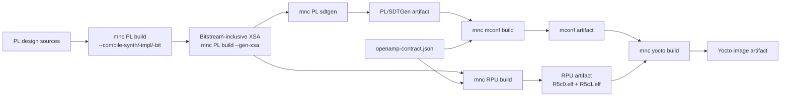

# Monutchee OS (MNCos) Project collection


## Introduction

This is a project collection of monutchee for building yocto on Xilinx devices.


## Included project

| Project      | Link                              |
| :----------  | :------------------------------   |
| zudemo       | [zudemo](zudemo/README.md)        |
| kr260demo    | [kr260demo](kr260demo/README.md)  |
| msap1        | [msap1](msap1/README.md)          |


## Initialize a product workspace

The manifests use standalone OE-Core and BitBake at Yocto 5.0.18, with the
headless-by-default MNCOS distro from `meta-monutchee`. For existing workspaces,
see [the standalone MNCOS migration](docs/standalone-mncos-migration.md), including
the command to synchronize only Yocto and initialize fresh build configuration.

**Before using the standalone MNCOS migration branch, remember to switch
`yocto-build/sources/meta-monutchee` to the matching branch too.** Selecting a
manifest branch alone does not select the layer branch. Follow the
[manual Yocto setup and branch override](#manual-yocto-setup-and-meta-monutchee-branch-override)
below before running `setupSDK`.

Each fresh product workspace contains three top-level directories:

- `applications/` is a repo client initialized from the product's
  `applications.xml`. It contains the APU, RPU, PL, and optional WEB
  repositories.
- `yocto-build/` is an independent repo client initialized from `yocto.xml`.
- `runtime-generated/` contains local build handoff files and is not managed
  by repo.

```bash
mkdir workspace && cd workspace
curl -fsSL "https://raw.githubusercontent.com/Monutchee/monutchee-manifest/main/<product>/setupWorkspace" | sh
```

Use `zudemo`, `kr260demo`, or `msap1` for `<product>`. The same command is
both installer and updater: in an empty directory it performs the complete
product setup; in an initialized workspace it refreshes only the generated
build scripts and workspace guidance. It does not switch or sync component
repositories during an update.

Test workflow changes from another manifest branch without changing the
installer URL:

```bash
curl -fsSL "https://raw.githubusercontent.com/Monutchee/monutchee-manifest/main/<product>/setupWorkspace" \
  | sh -s -- --branch feat/add_hex_on_artifact
```

On their first sync,
setup starts local `main` branches for the application repositories and
`yocto-build/sources/meta-monutchee`. Later setup runs preserve existing active
branches. Pinned Git submodules are initialized but remain outside the
applications manifest project set. Create or change one coordinated feature
branch across the application repositories with:

```bash
cd applications
repo start <branch> --all
repo checkout <branch>
```

Initialize a fresh directory. Setup deliberately refuses to adopt existing
standalone component clones inside `applications/` when that directory has no
`.repo`.

### Manual Yocto setup and meta-monutchee branch override

Use this procedure to initialize or synchronize only the Yocto sources from
GitHub while testing `feat/adopt_new_mncos`. Both repositories must have the
selected branch published. The example uses MSAP1; substitute the workspace
path, manifest product directory, and `--product` value for another product.

**The layer checkout inside `yocto-build/sources/meta-monutchee` must use the
migration branch before you source `setupSDK`.** Switching a separate clone
such as `/opt/monutchee/project/meta-monutchee` does not update this checkout.
The manifest currently specifies `main` for the layer, so `repo init -b`
alone can combine the new OE-Core layout with the old Poky-based setup script.
That mismatch produces `sources/poky/oe-init-build-env: no such file or directory`.

From a fresh terminal with no build running, initialize the manifest and add
the local layer override **before** `repo sync`:

```bash
mkdir -p /opt/monutchee/project/msap1/yocto-build
cd /opt/monutchee/project/msap1/yocto-build

repo init \
  -u https://github.com/Monutchee/monutchee-manifest.git \
  -b feat/adopt_new_mncos \
  -m msap1/yocto.xml

mkdir -p .repo/local_manifests
cat > .repo/local_manifests/mncos-development.xml <<'EOF'
<?xml version="1.0" encoding="UTF-8"?>
<manifest>
  <extend-project name="meta-monutchee"
                  revision="refs/heads/feat/adopt_new_mncos" />
</manifest>
EOF

repo sync -j4 --fetch-submodules
```

This override selects the layer branch on subsequent `repo sync` runs too.
Repo may leave the checkout at a detached HEAD; that is normal, provided it
contains the selected branch revision. If the other sources are already
synchronized and only the layer needs correcting, create the same override
and run `repo sync -j4 --fetch-submodules sources/meta-monutchee`.

For an existing Poky build, move `yocto-build/build` to an unused backup name
before creating the new configuration. Preserve the download and sstate caches
and transfer reviewed `local.conf` settings afterward; do not copy the old
`bblayers.conf`. See the [migration guide](docs/standalone-mncos-migration.md)
for the hardware configuration and build steps.

Refresh the workspace toolkit from your manifest checkout, then initialize:

```bash
bash /opt/monutchee/project/monutchee-manifest/common/setupWorkspace \
  --product msap1 \
  --workspace /opt/monutchee/project/msap1 \
  --branch feat/adopt_new_mncos \
  scripts

cd /opt/monutchee/project/msap1/yocto-build
printf '%s\n' msap1 > .mncos-product
source ./setupSDK --product msap1 build
bitbake-layers show-layers
```

The layer list should use `sources/openembedded-core/meta` and contain no
Poky layers. `setupSDK` is supplied by the layer checkout through a symlink;
it does not need to be copied or edited manually.

Keep the override until the migration is merged into **both** repositories'
`main` branches. Then remove `.repo/local_manifests/mncos-development.xml`,
rerun `repo init` with `-b main` and the same URL/product manifest, and run
`repo sync`. Update or remove the override whenever you intentionally change
the layer branch; it takes precedence over the manifest's layer revision.

## Automated hardware-to-Yocto build

`setupWorkspace ... all` installs one product-aware command in the workspace
root: `mnc`, a symlink to `.monutchee-build/mnc.sh`. It is also refreshed
independently with the `scripts` component.

```bash
./mnc all build        # full chain; TUI is automatic in a terminal
./mnc --cli all build  # full chain with the original streaming console
./mnc --tui all build  # explicitly request the TUI
./mnc --list           # the targets, their scripts, and the chain order
./mnc PL build         # one stage
./mnc PL status        # a read-only query
./mnc deploy           # deploy with the workspace preset (no build log)
```

`setupWorkspace` also creates `MncBuildPreset.yaml` beside `mnc`. Set
`stages.PL.jobs` to a positive integer (for example `1`) to limit only the PL
stage in both full-chain and direct builds; `null` keeps PL's automatic
default, and an explicit `--jobs` wins. The preset uses YAML and therefore
requires PyYAML (`python3-yaml` on distributions that package it).

The same preset configures deployment. JTAG is currently the only type:

```yaml
stages:
  deploy:
    type: jtag
    station_url: http://127.0.0.1:8042
    station_token: null
    station_token_file: null
    xilinx_hw_server_url: tcp:172.30.19.20:3121
    xilinx_target_serial: XFL1YADUCAY1A
    xilinx_target_id: null
    tftp_server_ip: 172.30.19.19
    board_ip: null
```

Direct loopback Station connections do not require a token. For a LAN or
remote Station, set `station_token` to the quoted output of
`sudo mnc-station token --service`, or set `station_token_file` to a private
token file. Never set both. A preset containing `station_token` must use mode
`0600` and must not be committed.

Set `xilinx_target_serial` to the JTAG cable serial shown by the Station UI.
The CLI scans the configured hardware server and submits the stable cable
serial and device index with the job. The artifact loader resolves that
identity again inside the XSDB process that performs the boot; the displayed
numeric XSDB target ID is session-local. Leave `xilinx_target_id` null unless
one cable exposes multiple ZynqMP PSU targets; the serial and ID settings are
mutually exclusive.

`mnc deploy` uploads the product's Station artifact and follows the resulting
job. Use `mnc deploy jtag` to name the type explicitly; matching command-line
options override the preset. Deployments intentionally do not create build
reports.

Every actual `build` command records the same complete console transcript and
final per-stage summary, regardless of interface, in
`runtime-generated/buildLog/build_YYYYMMDD_HHMMSS.log`.

Interactive `all build` and individual stage builds use the TUI by default.
The console stays in the background while the upper-right build pane shows
status, progress, and elapsed/final times. A system pane below it shows overall
CPU, RAM, and swap usage. Press `s` to show/hide the build pane or `r` to
show/hide the resource pane. Arrows or Page Up/Down scroll, `End` follows live
output, and Ctrl-C cancels. After completion, Enter or `q` exits. Use `--cli`
to force the original streaming console. Non-interactive builds and dry runs
automatically use CLI mode; `--tui` remains available as an explicit request.
RPU builds also serialize access to their Vitis workspace and surface selected
milestones from Vitis's private log. A concurrent RPU attempt exits immediately
with the active build's owner details instead of corrupting shared state. The
lock uses `flock` from the standard Linux `util-linux` package.

TAB completion for bash and zsh: `source ./mnc` registers it in the current
shell and does nothing else (executing cannot -- a child process cannot change
its parent's shell). The first `./mnc` run from a terminal also adds one
guarded line to your shell rc, so new shells have it;
`MNC_NO_COMPLETION_INSTALL=1` declines, and nothing is written without a
terminal.

The grammar is `mnc [OPTIONS] <target> <command> [--args] [ARGUMENTS...]`.
`deploy` is the one shorthand target whose command may be omitted.
Targets are the installed stage scripts, matched case-insensitively, so `PL`
and `pl` both reach `make_PL.sh`. `build` runs the stage bare and any other
command becomes `--<command>`, which makes every stage option reachable as a
command (`mnc RPU elf-only`, `mnc PL sdtgen`). Everything after the command is
forwarded to the stage script untouched: `--args` is an optional separator
that mnc drops, and `--` is never mnc's, so `mnc yocto build -- -c cleanall`
still reaches BitBake. mnc's own options come before the target, so a stage
option can never be mistaken for one of mnc's.

`mnc all build` runs the chain declared as `MNC_CHAIN` in the product profile,
stops at the first failing stage, and prints the command that resumes from it
(`mnc --from RPU all build`). The order is per-product because it genuinely
differs: where `RPU_DEPENDS_ON_MCONF` is true, `make_RPU.sh` consumes the
mconf artifact and publishing mconf afterwards would prune the RPU artifact,
so mconf must run first.

### MSAP1 build dependencies

MSAP1 uses a dependency graph rather than a strict four-stage waterfall. The
RPU and machine configuration are produced independently from the same XSA
and OpenAMP contract, then checked for compatibility by the Yocto stage.



`xparameters.h`, generated directly from the XSA by Vitis, remains
authoritative for hardware addresses and interrupts. The shared
`openamp-contract.json` is authoritative for R5/Linux shared memory and
mailbox policy. The Yocto stage requires the mconf and RPU artifacts to carry
matching XSA and OpenAMP-contract digests.

### Recommended clean-build order

After exporting the XSA, use this sequential order in one workspace:

```bash
./mnc PL build
./mnc RPU build
./mnc mconf build
./mnc yocto build
```

`mnc PL build` should run first because publishing a new upstream PL artifact
invalidates existing mconf, RPU, and Yocto artifacts. After that stage,
`mnc RPU build` and `mnc mconf build` are independent and may run in either order
or on separate DSP/BSP build machines. Both must finish before
`mnc yocto build`.

The responsibilities of each stage are:

1. `mnc PL build` generates the block-design output products, synthesizes,
   implements, writes the bitstream, exports the bitstream-inclusive XSA to
   `runtime-generated/bin_file/<ProjectPrefix>_PL.xsa`, and publishes
   `<product>_pl_sdtgen_<sha256[:6]>.tar.gz`, whose payload contains only
   SDTGen output. Every stage is separately selectable (`--build-bd`,
   `--compile-synth`, `--compile-impl`, `--compile-bit`, `--gen-xsa`,
   `--sdtgen`) and backed by one Tcl script in the PL repository, so a single
   stage can be rerun and debugged; with no stage option all of them run in
   that order. `--status`, `--summary`, and `--report` are read-only queries
   that report on the project rather than building it, and stay usable while
   a Vivado GUI holds it open. The Vivado stages need the PL repository to
   provide those scripts, so a product whose PL repository has none keeps
   using `--sdtgen` against a hand-exported XSA. Use `--xsa FILE` to export
   to, or read from, another location.
2. `mnc mconf build` consumes the SDTGen archive and publishes
   `<product>_mconf_<sha256[:6]>.tar.gz`. It contains portable generated Yocto
   `conf` fragments and SDTGen files. For MSAP1 it also renders and packages
   the OpenAMP domain from the shared contract.
3. For MSAP1, `mnc RPU build` consumes the raw XSA and OpenAMP contract directly,
   creates the Vitis platform, and publishes
   `<product>_rpu_<sha256[:6]>.tar.gz`, containing only `R5c0.elf` and
   `R5c1.elf`. It does not require mconf, source Yocto, or run BitBake.
   After the platform has been created once, use `mnc RPU elf-only` to
   rebuild both applications without recreating the platform, provided its
   XSA and contract provenance still match.
4. `mnc yocto build` consumes the mconf and RPU archives, runs the normal
   BitBake command, and publishes selected disk/boot/JTAG outputs as
   `<product>_yocto_<sha256[:6]>.tar.gz`.

The ZU and KR260 demo profiles retain their legacy mconf-to-RPU dependency.

### Focused rebuild examples

Rebuild only changed RPU application sources while reusing the current Vitis
platform, then integrate the new firmware:

```bash
./mnc RPU build --elf-only
./mnc yocto build
```

Regenerate only machine configuration while reusing a compatible RPU
artifact:

```bash
./mnc mconf build
./mnc yocto build
```

Rebuild after changing the OpenAMP contract but not the XSA:

```bash
./mnc RPU build
./mnc mconf build
./mnc yocto build
```

Rebuild only APU, frontend, kernel, or Yocto recipe changes:

```bash
./mnc yocto build
```

If either selected mconf or RPU artifact was produced from a different XSA or
OpenAMP contract, `mnc yocto build` stops with a lineage mismatch instead of
building a mixed image.

Every archive includes a manifest and checksums, validates its product/stage,
rejects unsafe archive paths, and verifies a hash suffix when one is present.
After a canonical stage publishes successfully, its older archives and every
downstream archive are removed. A complete build therefore retains one
coherent PL, mconf, RPU, and Yocto archive set; a failed build preserves the
previous set. Input selection still accepts legacy directories containing
multiple archives by choosing the newest match and warning. Pass an explicit
input artifact option to pin a particular handoff. Use `--help` on each
command for artifact paths and BitBake argument passthrough.

For coordinated feature testing, operate on the two repo clients separately:

```bash
(cd applications && repo start feature/add-compile-command-script --all)
(cd yocto-build && repo start feature/add-compile-command-script \
  sources/meta-monutchee)
```

The build commands support `zudemo`, `kr260demo`, and `msap1` through product
profiles in `common/build/products`.

# Reference
[Xilinx yocto-manifests](https://github.com/Xilinx/yocto-manifests)
