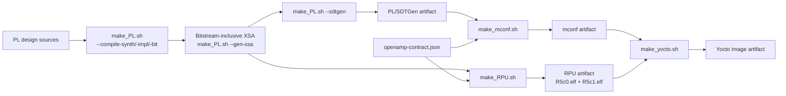

# msap1 project readme

## Introduction

msap1

## Initialization

### APU

| Name                   | Description                                               | Link                                                 |
|------------------------|-----------------------------------------------------------|------------------------------------------------------|
| MSAP1_APU        | The APU (running on A53 core) source code                 | [Link](https://github.com/Monutchee/MSAP1_APU)  |

### RPU

| Name                   | Description                                               | Link                                                 |
|------------------------|-----------------------------------------------------------|------------------------------------------------------|
| MSAP1_RPU        | The RPU (running on R5 core) source code                  | [Link](https://github.com/Monutchee/MSAP1_RPU)  |

### PL

| Name                   | Description                                               | Link                                                 |
|------------------------|-----------------------------------------------------------|------------------------------------------------------|
| MSAP1_PL         | The PL (FPGA) source code                                 | [Link](https://github.com/Monutchee/MSAP1_PL)   |

### WEB

| Name                   | Description                                               | Link                                                 |
|------------------------|-----------------------------------------------------------|------------------------------------------------------|
| MSAP1_WEB        | The React/TypeScript product frontend                     | [Link](https://github.com/Monutchee/MSAP1_WEB)  |

### Yocto 
| Name                       | Description                                               | Link                                                     |
|----------------------------|-----------------------------------------------------------|----------------------------------------------------------|
| monutchee-manifest (This)  | Initialize the yocto building enviroment using repo tools | [Link](https://github.com/Monutchee/monutchee-manifest/tree/main/msap1)   |
| meta-monutchee             | A yocto distro layer of the project                       | [Link](https://github.com/Monutchee/meta-monutchee)  

## Project dir Initialization

Run the following command from a fresh workspace directory:

```bash
curl -fsSL "https://raw.githubusercontent.com/Monutchee/monutchee-manifest/main/msap1/setupWorkspace" | sh
```

The same command also upgrades an existing workspace. In a fresh directory it
performs the complete initialization. When the MSAP1 workspace is already
initialized, it refreshes only `.monutchee-build/`, the root `make_*.sh`
wrappers, and `AGENTS.md`; component repositories are not synchronized or
switched.

Use a manifest feature branch while testing workflow changes:

```bash
curl -fsSL "https://raw.githubusercontent.com/Monutchee/monutchee-manifest/main/msap1/setupWorkspace" \
  | sh -s -- --branch feat/add_hex_on_artifact
```

Initial setup creates `applications/`, `yocto-build/`, and `runtime-generated/`.
`applications/` is a repo client initialized from `msap1/applications.xml`
and contains `MSAP1_APU`, `MSAP1_RPU`, `MSAP1_PL`, and `MSAP1_WEB`.
`yocto-build/` is a separate repo client initialized from `msap1/yocto.xml`.
Fresh application checkouts and `yocto-build/sources/meta-monutchee` are
automatically started on local `main` branches; later setup runs preserve
active branches.

APU's OpenAMP-helper, WebEngine library, and Glaze repositories and RPU's
OpenAMP-helper repository remain pinned Git submodules. They are fetched during
sync but are not included in applications `--all` branch operations.
`MSAP1_WEB` is the separate product frontend and is a top-level applications
manifest project.

```bash
cd applications
repo start <branch> --all
repo checkout <branch>
```

Use a fresh directory for the first run. Existing standalone component clones
inside `applications/` are not adopted automatically. The `yocto` and
`scripts` selectors remain available when only the Yocto repo client or build
wrappers are needed.

Every MSAP1 `setupWorkspace` invocation also refreshes the workspace-root
`AGENTS.md` from `msap1/AGENTS.md`. The generated copy provides cross-repository
guidance for AI coding tools; edit the manifest source rather than the generated
workspace file.

# VS Code initialization

Add the following lines to `.vscode/settings.json` to prevent to many yocto files generate crash the vscode

<details>

<summary><b>VScode recommended setting </b></summary>

```
    "files.exclude": {
        "yocto-build/build/**": false,
        "**/oe-workdir/**": true,
        "**/oe-logs/**": true
    },
    "search.exclude": {
        "yocto-build/build/**": true,
        "**/oe-workdir/**": true,
        "**/oe-logs/**": true
    },
    "files.watcherExclude": {
        "**/yocto-build/build/**": true
    },
    "C_Cpp.files.exclude": {
        "**/yocto-build/build/**": true
    },
    "git.ignoredRepositories": [
        "yocto-build/sources/meta-arm",
        "yocto-build/sources/meta-kria",
        "yocto-build/sources/meta-openamp",
        "yocto-build/sources/meta-openembedded",
        "yocto-build/sources/meta-virtualization",
        "yocto-build/sources/meta-xilinx",
        "yocto-build/sources/poky"
    ],
    "git.scanRepositories": [
        "yocto-build/sources/meta-monutchee",
        "applications/MSAP1_APU",
        "applications/MSAP1_DOC",
        "applications/MSAP1_PL",
        "applications/MSAP1_RPU",
        "applications/MSAP1_WEB",
    ],
    "cmake.useCMakePresets": "always",
    "cmake.sourceDirectory": "${workspaceFolder}/applications/MSAP1_APU",
    "clangd.arguments": [
        "--query-driver=/opt/**/aarch64-*-g++"
    ]
```

</details>


## Build Steps

### Updating the build scripts

Rerun the same setup command from the initialized workspace root to refresh
the generated build scripts from `main`:

```bash
curl -fsSL \
  "https://raw.githubusercontent.com/Monutchee/monutchee-manifest/main/msap1/setupWorkspace" \
  | sh
```

Use a manifest feature branch while testing workflow changes:

```bash
curl -fsSL \
  "https://raw.githubusercontent.com/Monutchee/monutchee-manifest/main/msap1/setupWorkspace" \
  | sh -s -- --branch feat/add_hex_on_artifact
```

An existing workspace refresh replaces `.monutchee-build/`, updates the four
root `make_*.sh` wrappers and `AGENTS.md`, and removes the obsolete generated
`updateBuildScripts.sh` helper. It does not sync or switch the PL, RPU, APU,
WEB, or Yocto repositories.

The generated build commands enforce this dependency graph:



The canonical OpenAMP policy is
`msap1/definition/openamp-contract.json`. `setupWorkspace` installs it below
`.monutchee-build/definitions/msap1/`. The RPU and machine-configuration
artifacts independently record its canonical SHA-256 and the XSA SHA-256.
Yocto accepts them only when both values match.

For a clean sequential build in one workspace, use:

```bash
./make_PL.sh
./make_RPU.sh
./make_mconf.sh
./make_yocto.sh
```

Run `make_PL.sh` first because a newly published PL/XSA artifact invalidates
all existing downstream artifacts. After that, RPU and mconf builds are
independent and may run in either order or on separate DSP/BSP build machines.
Both artifacts must exist and have matching XSA and contract digests before
`make_yocto.sh` runs.

`make_PL.sh` with no option runs all six of its build stages in order: block
design, synthesis, implementation, `write_bitstream`, XSA export, and SDTGen.
Each is also selectable on its own, which is how an iteration that only needs
part of the flow is driven, and how a failing stage is rerun:

```bash
./make_PL.sh --compile-synth                  # synthesis only
./make_PL.sh --compile-impl --compile-bit     # reuse the existing synthesis
./make_PL.sh --gen-xsa --sdtgen               # re-export and repackage only
```

`--build-bd` validates `TopDesign.bd` and generates its output products.
Those products are untracked, so a fresh checkout has no synthesizable
block-design sources until this stage runs; generation is incremental, so on
an up-to-date design it costs one validation pass.

Every stage returns a failure status when it fails and stops the remaining
stages, so invocations chain: `./make_PL.sh && ./make_RPU.sh`. The Vivado
stages each run one Tcl script from `MSAP1_PL/SourceData/Script`
(`build_bd.tcl`, `build_synth.tcl`, `build_impl.tcl`, `build_bitstream.tcl`,
`export_xsa.tcl`), keep a per-stage log under `MSAP1_PL/vivado_gen/logs/`,
and write reports to `MSAP1_PL/vivado_gen/reports/`. Because Vivado does not
lock projects, they refuse to run while a Vivado session of this user is
open; source the stage script in that session's Tcl console instead.
`--sdtgen` never opens the project and is unaffected.

Three read-only queries report on the project instead of building it, and
stay available while a Vivado GUI holds it open:

```bash
./make_PL.sh --status                      # what passed, what is out of date
./make_PL.sh --summary                     # timing, failed nets, power, elapsed
./make_PL.sh --report                      # index the stage reports and logs
./make_PL.sh --report impl_timing_summary  # print one of them
```

`--status` is the shell equivalent of the GUI's Design Runs window: one row
per run with status, progress, and the out-of-date flag, then a single
`PL_STATUS_VERDICT` line naming what to rerun. It also checks the handoff
chain Vivado cannot see -- whether the exported XSA predates the bitstream,
and whether the published SDT artifact records the current XSA's digest.
`--summary` prints the statistics Vivado stored on each run (WNS, TNS, WHS,
THS, failed nets, total power, elapsed). `--report` needs no Vivado at all.
The queries are opt-in, run after any build stage in the same invocation, and
exit zero whenever the report was produced -- the verdict is in the output,
not the exit status.

The mconf artifact is also self-describing. Its `openamp/` payload contains:

```text
openamp/openamp-contract.json
openamp/openamp-domain.yaml
```

The JSON file is the authoritative contract used to calculate
`openamp_contract_sha256`. The YAML file is generated from that JSON and is
the exact domain passed to gen-machineconf. `make_mconf.sh` verifies both
copies again before publishing the artifact.

`make_RPU.sh` no longer consumes mconf or Lopper output. It creates the Vitis
platform directly from the XSA and generates `openamp_contract.h` for both R5
cores. The header owns RPMsg shared-memory and mailbox policy; the BSP's
XSA-generated `xparameters.h` remains authoritative for AXI addresses and
interrupts. Use `make_RPU.sh --elf-only` only for an RPU-source-only change
with the same XSA and OpenAMP contract.

This enables parallel team handoff:

```text
DSP:
  export the XSA
  run make_RPU.sh

BSP:
  consume the same XSA
  run make_PL.sh
  run make_mconf.sh

Integration:
  run make_yocto.sh with matching RPU and mconf artifacts
```

Downstream-only changes do not rebuild their parents:

```bash
# RPU source only
./make_RPU.sh --elf-only
./make_yocto.sh

# Machine-configuration generation only
./make_mconf.sh
./make_yocto.sh

# OpenAMP contract changed, but XSA is unchanged
./make_RPU.sh
./make_mconf.sh
./make_yocto.sh

# APU, WEB, or Yocto packaging only
./make_yocto.sh
```

Each successfully published canonical artifact replaces older archives from
its stage. A PL/XSA change invalidates mconf, RPU, and Yocto; an mconf or RPU
rebuild invalidates only Yocto. After the complete pipeline,
`runtime-generated/bin_file` contains one coherent PL, mconf, RPU, and Yocto
archive set. Failed builds retain the prior set. Scripts still select the
newest hash-named input when handling a legacy directory containing multiple
archives; incompatible XSA or contract hashes stop the build. Legacy RPU
artifacts require one complete rebuild.


### yocto
Get the newest `msap1_yocto_<sha256[:6]>.tar.gz` Yocto artifact. The suffix is
the first six hexadecimal characters of that archive's SHA-256.

```bash
artifact="$(ls -1t msap1_yocto_*.tar.gz | head -n 1)"
tar -xzvf "${artifact}" && (cd monutchee-artifact-v1/payload/msap1_yocto/jtag && xsdb load-jtag-image.tcl 127.0.0.1 192.168.61.147)
```

For a more detailed build guide, Please refer to [msap1-readme](https://github.com/Monutchee/meta-monutchee/blob/main/meta-msap1/README.md) for main reference.

### Advance configuration

The generated MSAP1 build template already selects the local APU checkout. To
override it in `conf/local.conf`, use:
```bash
APU_RPU_CTL_SRC = "local"
APU_RPU_CTL_GIT_BRANCH = "main"
APU_RPU_CTL_LOCAL_DIR = "${TOPDIR}/../../applications/MSAP1_APU"
```
